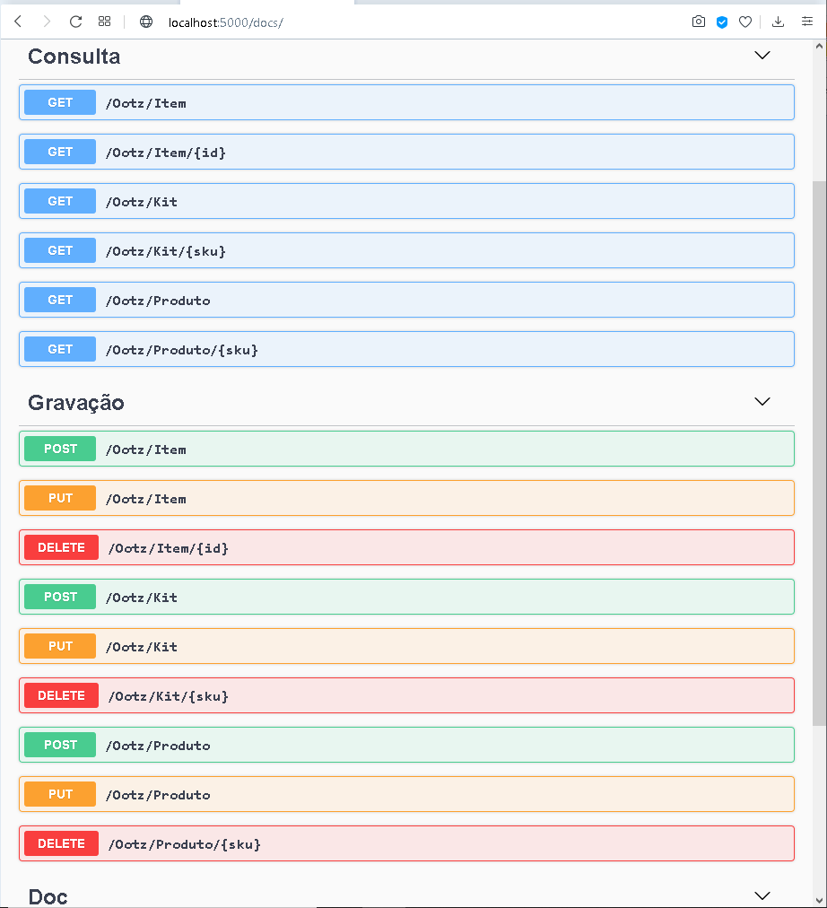

# Desafio Ootz

##### Autor: `Júlio Cascalles`


---
### Conteúdo
O projeto _Ootz_ é um teste que visa demonstrar funções básicas de um back-end Python para e-commerce com kits de produtos.

Recursos:
* Documentação Swagger automática*;
* Flask Restful;
* MVC** com Marshmallow e SqlAlchemy;
* DAO para banco de dados em Grafos "Neo4J";
* Testes unitários com Pytest.
* <s>Autenticação por JWT</s> (desabilitado)

### Como rodar
Existem 2 maneiras de configurar o banco de dados:
1. Alterar o default das variáveis em `/service/db_connection.py`
2. Usar (no Windows) algo como o _batch_ "**run.bat**" onde as variáveis de ambiente são atribuídas
> É importanto você escolher um dos [banco de dados](#banco-de-dados) disponíveis.

---

### Endpoints
Supondo que você esteja rodando esta API **localmente**, as seguintes rotas estarão disponíveis:
    
* `/docs` Traz a documentação _Swagger_ com todos os verbos REST disponíveis para a API e exemplos funcionais (Os verbos REST podem ser usados diretamente no browser, ou com algum programa como _POSTMAN_...)


* `/Ootz/Produto` Pode ser usado para trazer várias produtos (onde você pode passar uma query na url, p.ex.: `...?nome=Caderno`)
    * você pode também passar um `.../<sku>`
    para operações que exigem um registro único (consulta por campo chave ou exclusão)
        * sku é sigla para ["Stock Keeping Unit"](https://pt.wikipedia.org/wiki/Stock_Keeping_Unit) -- 
        (Unidade de Manutenção de Estoque).
    * Em caso de **POST** ou **PUT** é preciso passar o JSON adequado no _body_ da requisição (o formato do JSON estará na documentação Swagger).
    * No **PUT**, só é necessário passar o campo chave e o que vai ser alterado.

* `/Ootz/Kit` Funciona igual _/Ootz/Produto_ só que para **Kits**.
  * um *kit* é uma promoção onde vários produtos juntos em certas quantidades dão descontos.
  * O kit é vendido como um único produto, tanto que tem um **_sku_** próprio.

* `/Ootz/Item` Relaciona uma **Kit** com uma **Produto**.
  * Cada item do kit informa a quantidade e o desconto para cada tipo de produto.
* `/Ootz/Calculo/<sku>` Ao passar o sku do kit, calcula o seguinte:
  * custo: O custo total do kit;
  * preco: A soma dos preços com os descontos;
  * qtd_max: A quantidade máxima possível de kits, de acordo com os produtos disponíveis no estoque.

---

### Banco de dados
> Como exemplo, estou usando um DAO, feito totalmente por mim, para o banco de dados em grafos **Neo4J**.

Esta API foi testada por mim para usar qualquer um dos bancos de dados abaixo:
* Neo4J
* MongoDB
* DynamoDB 
* MySql
* SqlServer
* Postgres
* Sqlite.

---
### Testes unitários
As seguintes situações foram testadas para verificar se cada serviço está funcionando conforme esperado:

* Falha na busca: Deve retornar status 404 quando não encontra o registro
* Sucesso na busca: Retorna o registro relacionado ao campo chave usado na busca;
* Falha de inclusão: Não permite registro com campos inválidos;
* Sucesso na inclusão: Simula a gravação de um registro e retorna sem erros;

---
### Dados gerados

Os dados abaixo são resultado dos testes com a API.
A gravação dos registros pode ocorrer de várias formas:
* Gravar um Kit, gravar uma Produto e então Gravar um Item;
* Gravar tudo num único JSON representando todos os relacionamentos:

```
 {
    "id": "101",
    "quantidade": 2,
    "desconto": 10,
    "produto": {
      "sku": "cad-anot-red-bug",
      "nome": "Caderno de anotações Red Bug",
      "custo": 4.25,
      "preco": 6.5,
      "estoque": 50
    },
    "kit": {
      "sku": "kit-va-trabalhar",
      "nome": "Kit Vá Trabalhar"
    }
  }
```

