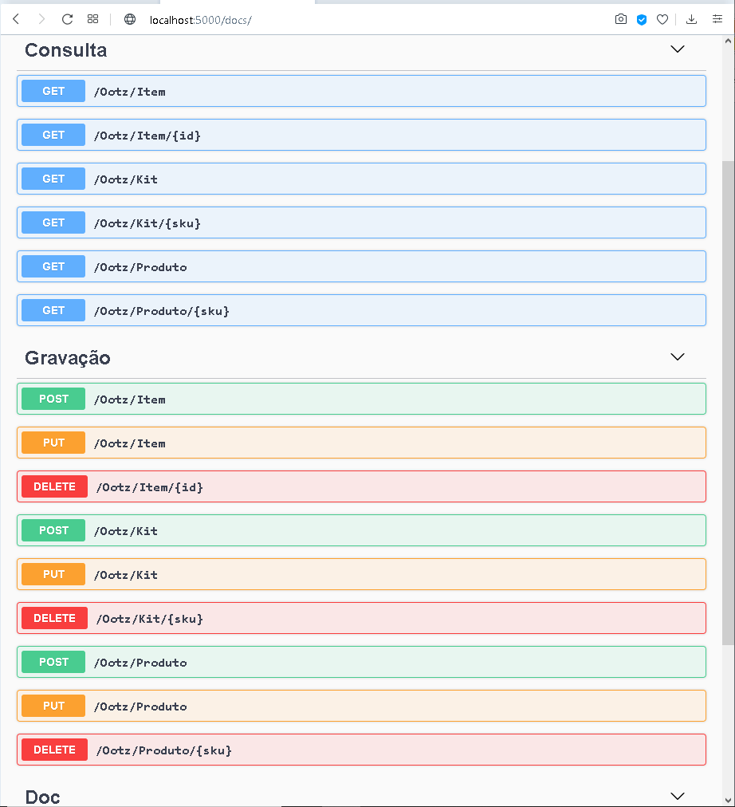
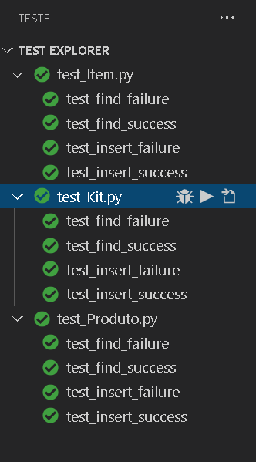
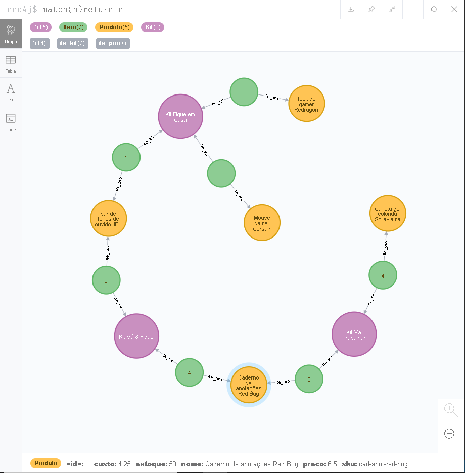

# Desafio ATADOS

##### Autor: `Júlio Cascalles`


---
### Conteúdo
O projeto _Atados_ é um teste que visa demonstrar funções básicas de um back-end Python que gerencia voluntários em ações sociais.

Recursos:
* Documentação Swagger automática*;
* Flask Restful;
* MVC** com Marshmallow e SqlAlchemy;
* DAO para banco de dados em Grafos "Neo4J";
* Testes unitários com Pytest.


### Endpoints
Supondo que você esteja rodando esta API **localmente**, as seguintes rotas estarão disponíveis:
    
* `/docs` Traz a documentação _Swagger_ com todos os verbos REST disponíveis para a API e exemplos funcionais (Os verbos REST podem ser usados diretamente no browser, ou com algum programa como _POSTMAN_...)


* `/Atados/Acao` Pode ser usado para trazer várias ações (onde você pode passar uma query com na url, p.ex.: `...?local=Salvador`)
    * você pode também passar um `.../<nome>`
    para operações que exigem um registro único (consulta por campo chave ou exclusão)
    * Em caso de **POST** ou **PUT** é preciso passar o JSON adequado no _body_ da requisição (o formato do JSON estará na documentação Swagger).
    * No **PUT**, só é necessário passar o campo chave e o que vai alterado.

* `/Atados/Pessoa` Funciona igual _/Atados/Acao_ só que para **Pessoas**.

* `/Atados/Voluntario` Relaciona uma **Pessoa** com uma **Ação**.

---

### Configuração de banco de dados
> Como exemplo, estou usando um DAO, feito totalmente por mim, para o banco de dados em grafos **Neo4J**.

Esta API foi testada por mim para usar qualquer um dos bancos de dados abaixo:
* Neo4J (o atual);
* MongoDB;
* AWS DynamoDB 
* MySQL;
* Sql Server;
* PostgreSQL;

---
### Testes unitários
As seguintes situações foram testadas para verificar se cada serviço está funcionando conforme esperado:

* Falha na busca: Deve retornar _"Not found"_ quando não encontra o registro
    * Não usei status 404 porque isso resulta em erro para vários SPA como React e Angular;
* Sucesso na busca: Retorna o registro relacionado ao campo chave usado na busca;
* Falha de inclusão: Não permite registro com campos inválidos;
* Sucesso na inclusão: Simula a gravação de um registro e retorna sem erros;

---
### Dados gerados

Os dados abaixo são resultado dos testes com a API.
A gravação dos registros pode ocorrer de várias formas:
* Gravar uma Ação, gravar uma Pessoa e então Gravar um Voluntariado;
* Gravar tudo num único JSON representando todos os relacionamentos:

```
 {
    "id": 2,
    "inicio": "2020-04-01",
    "pessoa": {
      "nome": "Eletéro Marcolino",
      "sobrenome": "da Silva",
      "bairro": "São Paulo",
      "cidade": "Pinheiros"
    },
    "acao": {
      "nome": "RoomsAgainstCovid",
      "instituicao": "Tech4Covid",
      "local": "Curitiba",
      "descricao": "Alocação de profissionais de saúde próximos aos seus locais de trabalho"
    }
```

